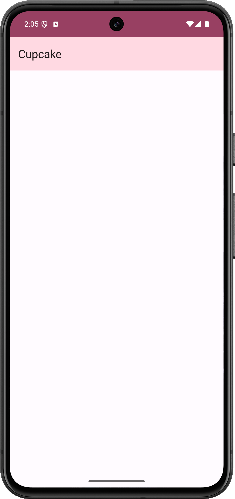
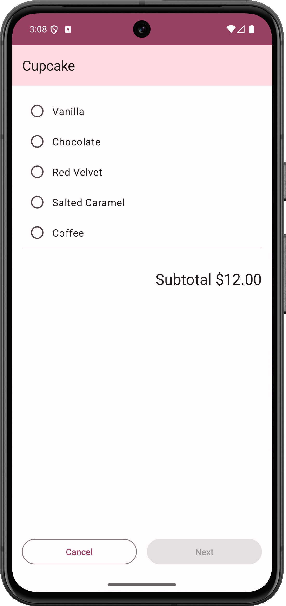
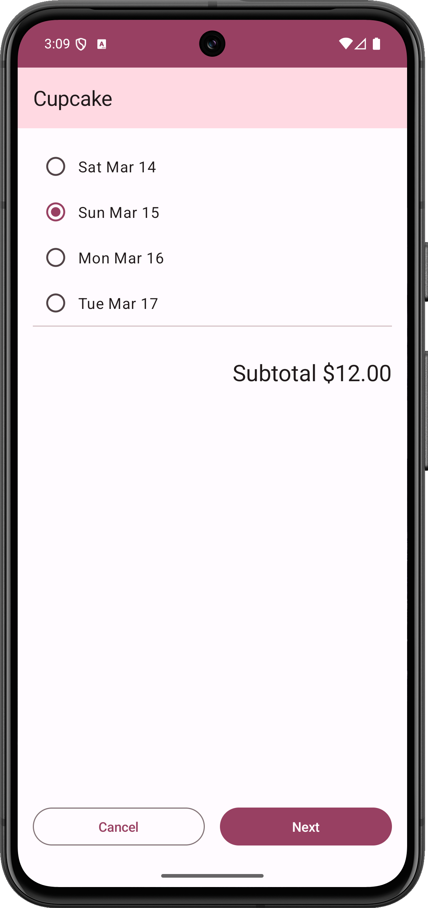
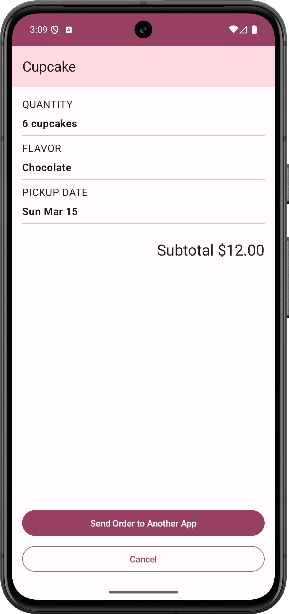
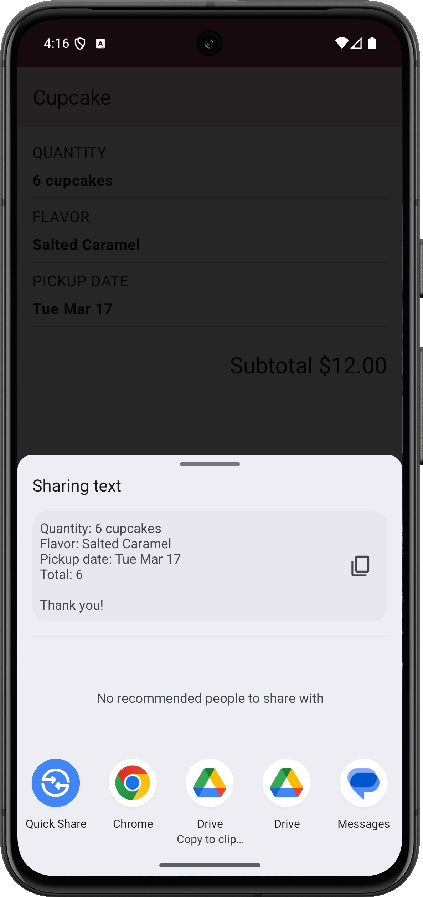
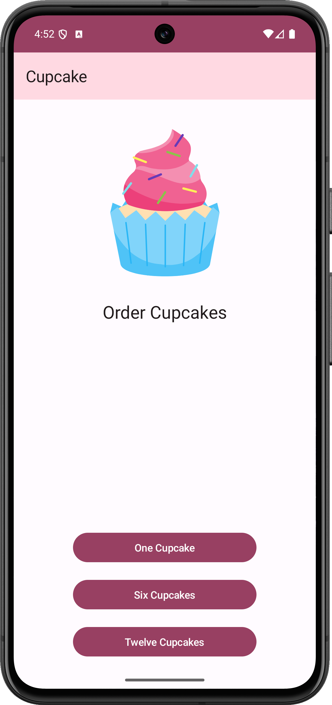
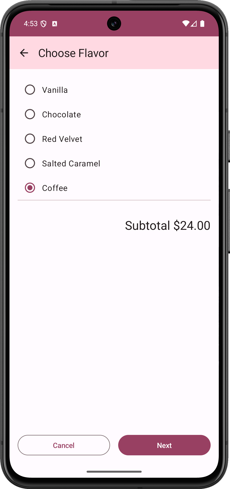
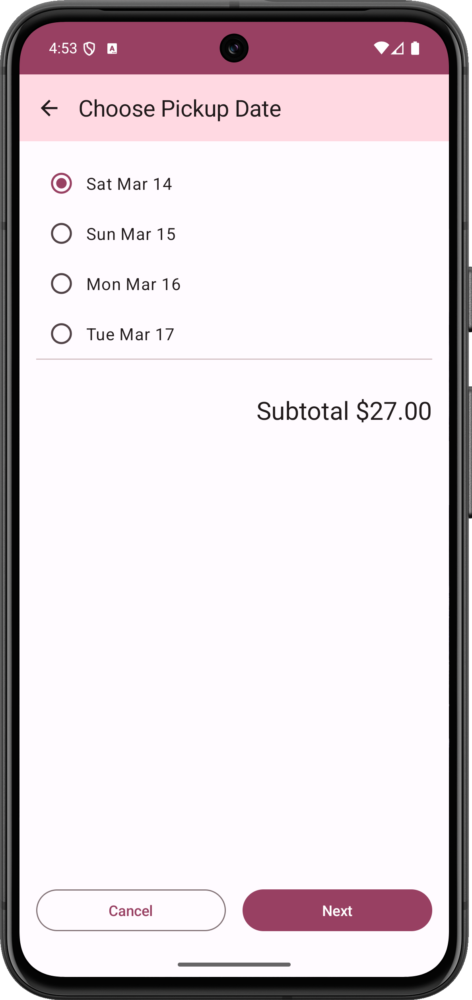
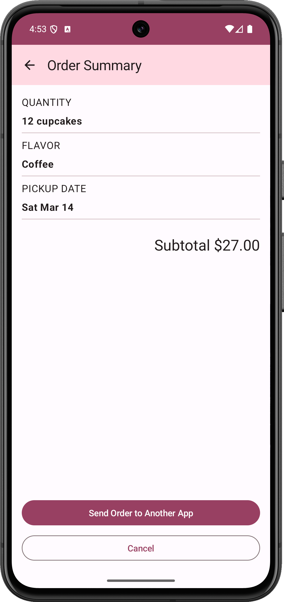

Cupcake app
=================================

This app contains an order flow for cupcakes with options for quantity, flavor, and pickup date.
The order details get displayed on an order summary screen and can be shared to another app to
send the order.

### Screenshots - Navigation

### Navigation - NavHostController 

### Cancel Order - Navigate back to Start Order Screen

### Share Order to Another App

### NavigateBack Arrow Button - Navigate back to Start Order Screen

Pre-requisites
--------------
* Experience with Kotlin syntax.
* How to create and run a project in Android Studio.
* How to create composable functions 

Getting Started
---------------
1. Install Android Studio, if you don't already have it.
2. Download the sample.
3. Import the sample into Android Studio.
4. Build and run the sample.
